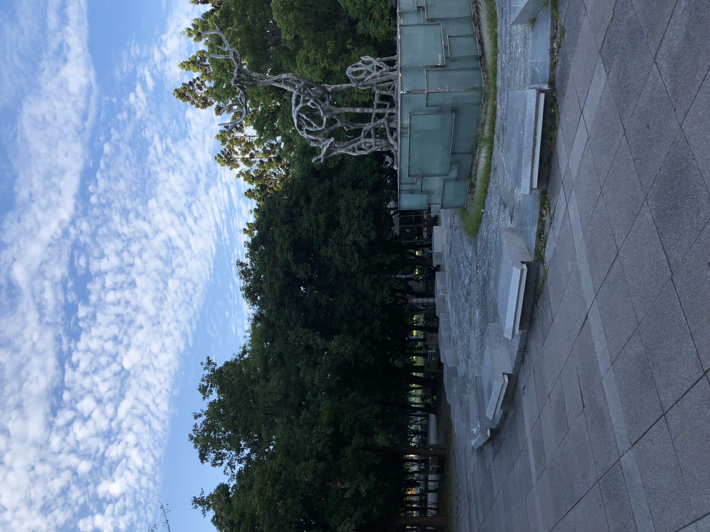
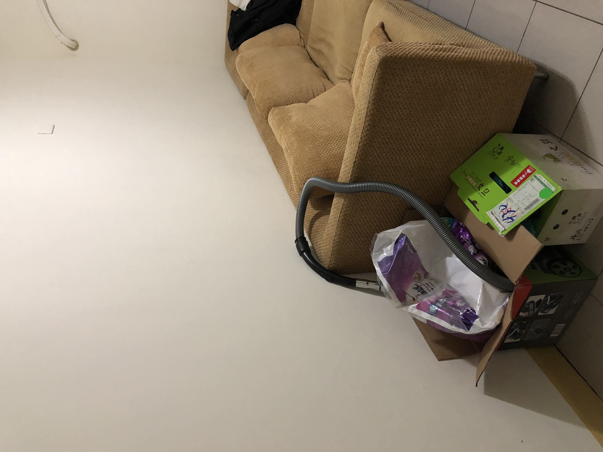
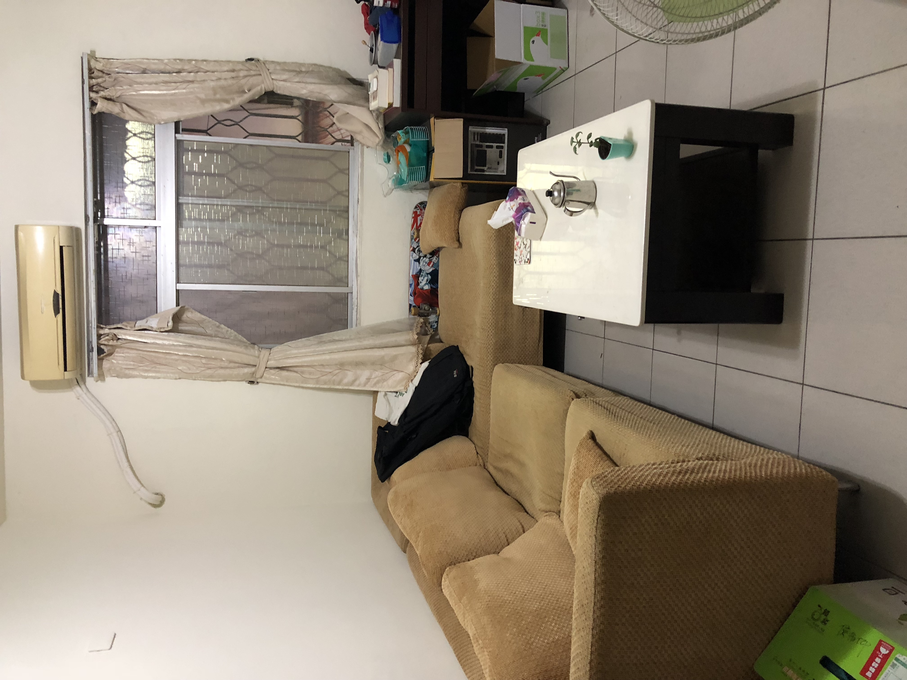

# 陳麒皓 <span style="color:red">(student ID : 106061516)</span>

# Project 2 / Panorama Stitching

## Overview
The goal of this project is to implement panorama stitching in python. We will find SIFT keypoints from multiple images and then match them to build a single panoramic image.  
To implement this project, we just need to follow these steps:  
(1)Get SIFT points and descriptors  
(2)Matching SIFT Descriptors  
(3)Fitting the Transformation Matrix  
(4)RANSAC  
(5)Stitching Multiple Images  

## Implementation
1. Matching SIFT Descriptors (SIFTSimpleMatcher.py)
   Use Euclidean distance to calculate the similarity between two features in two image.
   ```
   match = []
   for i in range(len(descriptor1)):
        distance = []
        d1_repeat = np.tile(descriptor1[i], (len(descriptor2), 1))
        distance = np.sqrt(np.sum((d1_repeat - descriptor2)**2, axis=1))
        distance_sorted = np.sort(distance)
        if distance_sorted[0] < THRESH*distance_sorted[1]:
            match.append([i, np.argmin(distance)])
   match = np.array(match)
   ```  
   
2. Fitting the Transformation Matrix (ComputeAffineMatrix.py)  
   We have a list of matched keypoints across the two images. Then, we need to find a transformation matrix that maps an image 1 point to the corresponding coordinates in image 2. In other words, this transformation matrix satisfies ```p1 * H' = p2```.
   ```
   h = np.linalg.lstsq(P1.T, P2.T, rcond=-1)[0]
   H = h.T
   ```
3. RANSAC(RANSACFit.py)  
   Use RANSAC to find a robust affine transformation so that we can get a more robust estimation of affine transformation from p1 to p2. We have to use ComputeError() function in RANSACFit.py to find the Euclidean distance between p1 and p2, so we can get the more reliable pairs.
   ```
   P1 = np.concatenate([pt1[match[:,0]], np.ones([len(match),1])], axis=1)
   P1 = np.matmul(H, P1.T).T
   P2 = np.concatenate([pt2[match[:,1]], np.ones([len(match),1])], axis=1)
   dists = np.linalg.norm(P1-P2, axis=1)
   ``` 
4. Stitching Multiple Images(MultipleStitch.py)  
   We choose the middle image as the reference image, and the outputed panorama is in the same coordinate system as the reference image. We need a transformation matrix that will convert points in frame i to frame ref. If the current frame index is smaller than referent frame index, we can just continuedly multiply the transformation matrix. However, if the current frame index is smaller than referent frame index, we have to calculate the previous transfromation matrix by multiply the inverse of current transformation matrix.
   ```
   if currentFrameIndex < refFrameIndex:
        for i in range(currentFrameIndex, refFrameIndex):
            T = np.matmul(T, i_To_iPlusOne_Transform[i])
   elif currentFrameIndex > refFrameIndex:
        for i in range(refFrameIndex, currentFrameIndex):
            T = np.matmul(T, i_To_iPlusOne_Transform[i])
        T = np.linalg.pinv(T)
   ```

## Installation
* Required packages  
Prerequired packages: Anaconda python 3.6  
Install cyvlfeat for fetching sift features: conda install -c menpo cyvlfeat

* How to compile from source?  
python StitchTester.py&emsp;(for multiple pictures with 3 or more)  
python TransformationTester.py&emsp;(for only two pictures)

### Results  
#### Combine two pictures  
<table border=1>
<tr>
<td>  


</td>
</tr>
</table>  

#### Combine three or more pictures  
<table border=1>
<tr>
<td>  


</td>
</tr>
</table>

### Try the data taken by myself
#### Example1  
<table border=1>
<tr>
<td>  
	



</td>
</tr>
</table>  

#### Example2  
<table border=1>
<tr>
<td>  
	





</td>
</tr>
</table>  

#### Example3  
<table border=1>
<tr>
<td>  
	


</td>
</tr>
</table>

